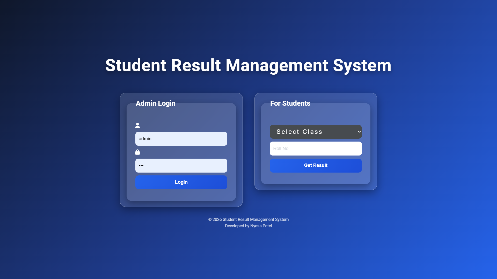
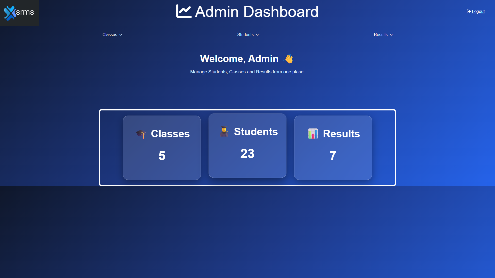

# 🎓 Student Result Management System

## 📌 About The Project

A web-based Student Result Management System developed using PHP, MySQL, HTML, CSS and JavaScript.

This project allows administrators to manage students, classes and examination results, while students can check their results using their roll number.

## 🚀 Features

- Admin Login
- Dashboard
- Add Class
- Manage Classes
- Add Students
- Manage Students
- Add Results
- Manage Results
- Search Students
- Student Result Portal
- Responsive User Interface

## 🛠 Technologies Used

- PHP
- MySQL
- HTML5
- CSS3
- JavaScript
- XAMPP

## 📂 Project Structure

```text
Student-Result-Management-System

├── css
├── database
├── images
├── screenshots
├── add_classes.php
├── add_students.php
├── add_results.php
├── dashboard.php
├── login.php
├── manage_classes.php
├── manage_students.php
├── manage_results.php
├── student.php
└── README.md


## 📷 Screenshots

### Login Page


### Dashboard


### Add Class


### Add Result


### Add Student


### Manage Class


### Manage Result


### Manage Student


## ⚙ Installation

1. Install XAMPP Server

2. Copy the project folder into the htdocs folder

3. Start Apache and MySQL from XAMPP

4. Open phpMyAdmin

5. Import the SQL database file

6. Open the project in your browser:

```text
http://localhost/Student-Result-Management-System
```

## 🔮 Future Improvements

- Student login module
- Result analytics dashboard
- Better UI design
- Mobile responsive improvements
- Export results as PDF

  
## 👩‍💻 Developed By

**Nyasa Patel**  
Computer Engineering Student
